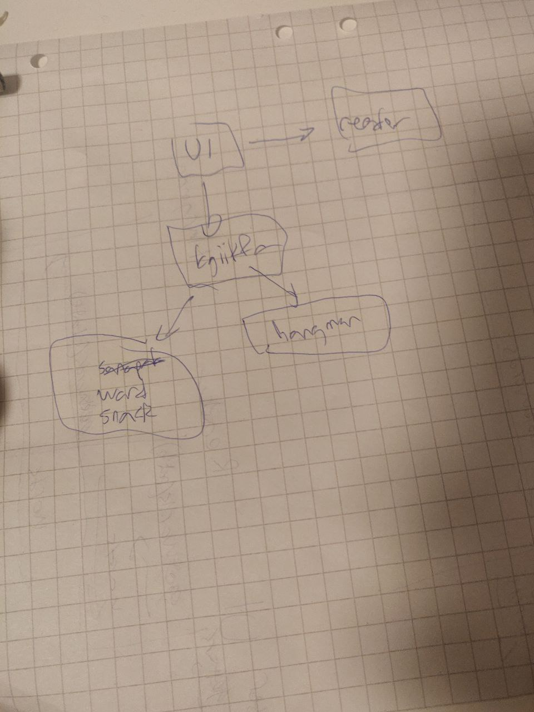
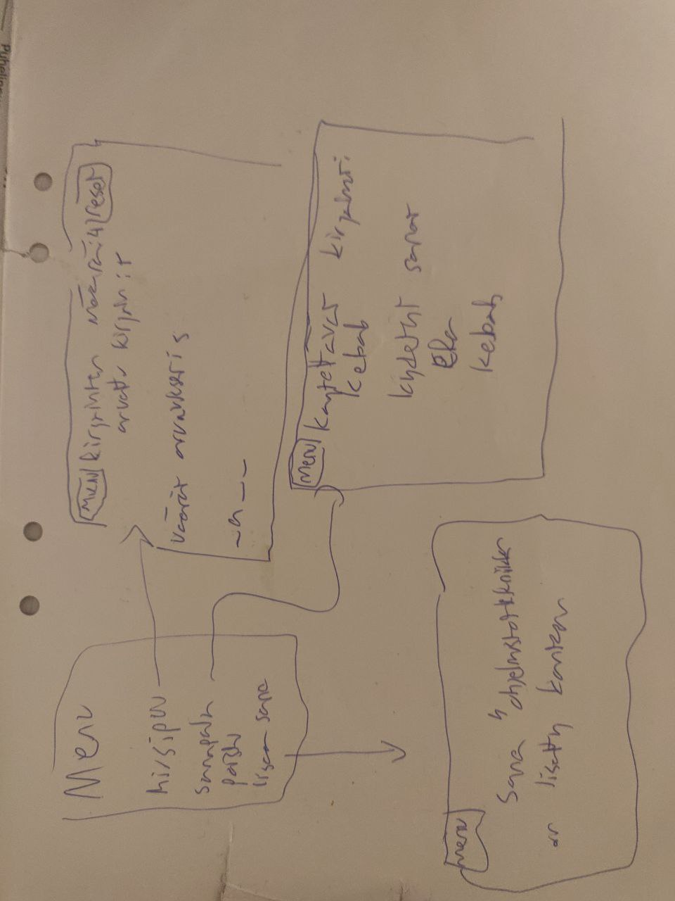
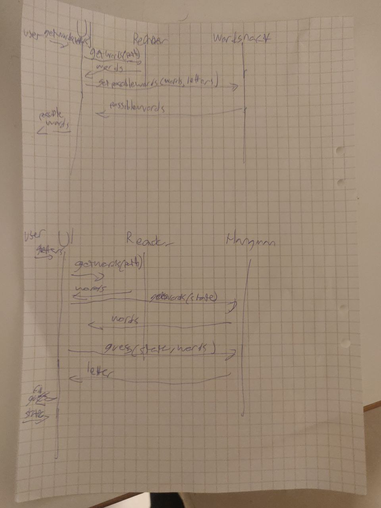

# Arkkitehtuurikuvaus

## Rakenne

ohjelman logiikkamoduulit ovat src/logic alla. datankäsittelymoduulit ovat src/reader alla, kuvat ja tietokannat ovat src/resources alla ja ui on src/ui alla. src/index.py käynnistää ohjelman

ohjelma toimii siten että ui piirtää kaiken ja kutsuu logiikkamoduuleita aina kun pitää päätellä jotain ja ui kutsuu datan hakemismoduuleita ja välittää niiden tiedot logiikkamoduuleille

## Käyttöliittymä
käyttöliittymä sisältää neljä eri näkymää:

* menu
* sanojen etsintä
* hirsipuun arvaaminen
* sanan lisäys

Jokainen niistä on toteutettu UI luokkaan omaksi metodiksi.

kun jossain näissä näkymistä pelin tilanne muuttuu niin lähetetään käyttäjän inputti logiikkamoduuleille ja piirretään uusi pelitilanne logiikkamoduuleiden outputin perusteella.

## Sovelluslogiika
sovelluksen loogisen tietomallin luo hangman ja wordSnack luokat. Molemmat niistä vastaa yksin siihen liittyvän logiikan toteutuksesta. Tälläisiä toimintoja ovat
* sanojen listaus
* parhaan arvauksen ehdottaminen
* arvauksen tuloksen käsittely

## Tietojen pysyvätallennus
pakkauksen reader luokka Reader vastaa tallennetun datan lukemisesta ja kirjoittamisesta. Ohjelman mukana tulevat sanatiedostot ovat tallennettu src/resources hakemistoon, mutta käyttäjä voi laittaa reader luokan lukemaan tiedoston mistä vain koneeltaan.

## Päätoiminnallisuudet
ohjelmalla on kaksi päätoiminnallisuutta, eli sanapalassa ja hirsipuussa voittaminen. Hirsipuussa arvataan aina yhtä kirjainta kerralla johon käyttäjä kertoo onko se oikein vai ei ja missä määrin

sanapala toiminnallisuus kertoo mahdolliset sanat

## Muut toiminnallisuudet
Muina toiminnallisuuksina on sanatiedostoihin sanojen lisäys, jos siellä on käyttäjän mielestä puutteita

## Ohjelmaan jääneet heikkoudet
sanojen hakeminen on nyt laitettu UI luokan vastuulle, vaikka logiikkamoduulit voisivat itse hakia tarvittavan datan

